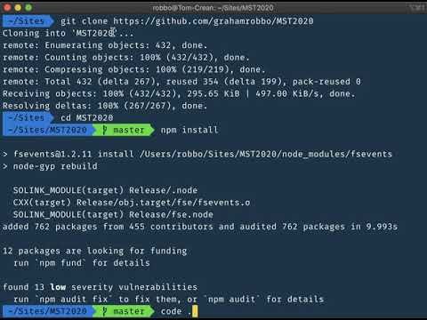
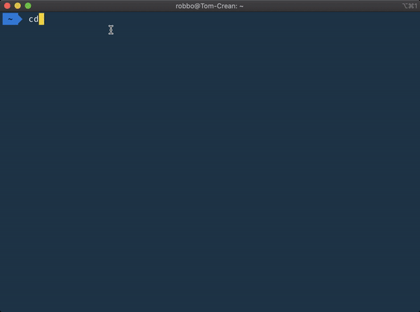
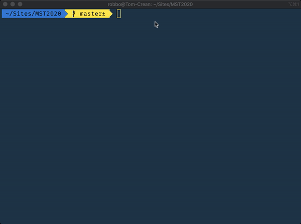
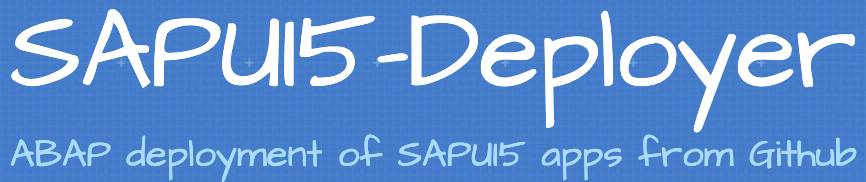
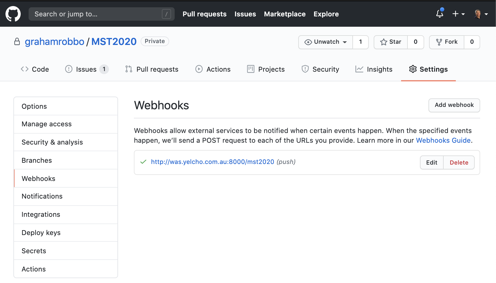

# Building and Deploying SAPUI5 Applications

This repository contains the supporting material for the Mastering SAP Technologies 2020 session about my SAPUI5 development environment and workflow.

It also contains the sample UI5 application used in the demos.

Enjoy!


## My SAPUI5 Development Environment

|              | https://git-scm.com/                                                                                                                                                                                                                                              |
| ------------------------------------ | ----------------------------------------------------------------------------------------------------------------------------------------------------------------------------------------------------------------------------------------------------------------- |
|         | **https://nodejs.org**                                                                                                                                                                                                                                            |
|          | **http://nginx.org/**                                                                                                                                                                                                                                             |
|        | **https://code.visualstudio.com/**                                                                                                                                                                                                                                |
|            | **https://gulpjs.com/**                                                                                                                                                                                                                                           |
|    | **[Settings Sync](https://marketplace.visualstudio.com/items?itemName=Shan.code-settings-sync)** VSCode extension from [Shan Khan](https://marketplace.visualstudio.com/publishers/Shan) to bring across my VSCode preferences - i.e. extensions and settings. \* |
|  | **https://github.com/tonsky/FiraCode** Fira Code font from Nikita Prokopov [@nikitonsky](https://twitter.com/nikitonsky) - a free monospaced font containing ligatures for common programming multi-character combinations.                                       |

_\* Note: The VSCode developers have been working over the last couple of months to support synchronising VS Code preferences across machines. By the time you are reading this the settings synchronisation feature will probably be part of the standard VSCode distribution and this extension will not be required._

---

The video shows how I would setup my development environment on a Windows machine. The process is almost identical for macOS.

### Put video here

TODO: Put in correct video

[](https://youtu.be/l2JEKBvxwDQ "Setup development environment")

## Other notes

I use a subdirectory called `Sites` located in my home directory as the root directory for all my projects.

The nginx configuration contains the following setting to reflect this.

```json
        location / {
            root   /Users/robbo/Sites;
            index  index.html index.htm;
            autoindex on;
            add_header Cache-Control "no-store, no-cache, must-revalidate";
        }
```

The `add_header` setting ensures that everything served up from that location will not be cached in the browser.

The nginx configuration also needs to set up the reverse proxy for your SAP backend server.

```json
       location /sap {
            proxy_set_header Host $host;
            proxy_set_header X-Real-IP $remote_addr;
            proxy_set_header X-Forwarded-For $proxy_add_x_forwarded_for;
            proxy_http_version 1.1;
            proxy_set_header Upgrade $http_upgrade;
            proxy_set_header Connection "Upgrade";
            proxy_pass http://was.yelcho.com.au:8000/sap;
       }
```

For websockets support add the following HTTP config setting so that nginx wil acrt as a websocket proxy.

```json
    upstream websocket {
        server was.yelcho.com.au:8443;
    }
```

My complete `nginx.conf` file looks like this.

```json
    worker_processes  1;

    events {
        worker_connections  1024;
    }

    http {
        include       mime.types;
        default_type  application/octet-stream;

        sendfile        on;
        keepalive_timeout  65;
        upstream websocket {
            server was.yelcho.com.au:8443;
        }

        server {
            listen       80;
            server_name  localhost;

            location / {
                root   /Users/robbo/Sites;
                index  index.html index.htm;
                autoindex on;
                add_header Cache-Control "no-store, no-cache, must-revalidate";
            }

            location /sap {
                  proxy_set_header Host $host;
                  proxy_set_header X-Real-IP $remote_addr;
                  proxy_set_header X-Forwarded-For $proxy_add_x_forwarded_for;
                  proxy_http_version 1.1;
                  proxy_set_header Upgrade $http_upgrade;
                  proxy_set_header Connection "Upgrade";
                  proxy_pass http://was.yelcho.com.au:8000/sap;
            }

            # customised 404 error page
            error_page  404              /404.html;
            location = /404.html {
                root   /Users/robbo/Sites;
            }
        }
    }
```

Finally the VSCode projectManage extension needs to know where to look for git projects. This is set in the _settings.json_ file.

```json
    "projectManager.git.baseFolders": [
      "/users/robbo/Sites",
    ],
```

## To work on a project

To start work on a project just clone the repo to the `Sites` directory and execute `npm install` to download the dependencies.



To prepare a project for deployment execute the command `gulp dist` - or even better configure it as the default build task in VSCode.



---

## Deployment to ABAP backend server



I created the [Yelcho/sapui5-deployer](http://yelcho.github.io/sapui5-deployer/) project about 5 years ago and still use it to deploy UI5 applications to my ABAP systems.

SAPUI5-Deployer is a solution for deploying SAPUI5 and OpenUI5 web apps to a SAP ABAP Web Application Server automatically.

SAPUI5-Deployer can be implemented by the an ABAP developer in minutes, in most cases without the need for any infrastructure changes, whilst conforming to existing change management policies and procedures.

If possible I usually setup a [Github webhook](https://docs.github.com/en/developers/webhooks-and-events/about-webhooks) to trigger deployment whenever a push to the repository event is fired.



If this is not possible the SAPUI5-Deployer ABAP program can be scheduled to regularly poll the repository and trigger a deployment when changes are detected.


